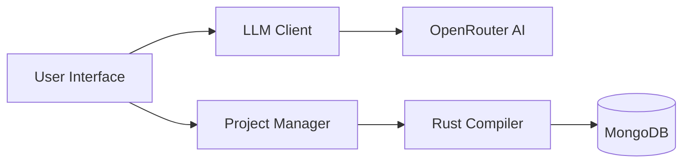

# 🦀 Rust IDE with RAG-Enhanced LLM Integration

A sophisticated IDE system that leverages RAG-enhanced Large Language Models to generate intelligent, memory-safe Rust code. Built with Qwen2.5 Coder 7b and advanced knowledge retrieval systems.

## 🎯 Core Features

### 🧠 Intelligent Code Generation
- **Natural Language Processing**: Convert requirements to Rust code
- **RAG-Enhanced Context**: Leverage [`RustKnowledgeBase`](Rust_coder_llm/Rust_coder_llm/src/rag_engine.py) for smart suggestions
- **Memory-Safe Patterns**: Automated implementation of Rust idioms
- **Project Scaffolding**: Smart project structure generation

### 🛠️ Advanced Capabilities
- **Real-time Error Detection**: Instant compilation feedback
- **Automated Error Resolution**: Smart error fixing with [`ProjectFixer`](Rust_coder_llm/Rust_coder_llm/src/project_fixer.py)
- **Dependency Management**: Intelligent Cargo.toml generation
- **Context Persistence**: MongoDB-based interaction tracking

## 🏗️ Architecture

### System Components
- **API Layer**: FastAPI-based HTTP interface
- **LLM Integration**: OpenRouter AI (Qwen2.5)
- **Knowledge Engine**: Custom RAG implementation
- **Compiler Interface**: Native Rust toolchain
- **Storage Layer**: MongoDB for persistence



## 📋 Prerequisites

1. **Runtime Environment**
   - Python 3.7 or higher
   - Rust and Cargo toolchain
   - MongoDB (running locally or remote)

2. **API Keys**
   - OpenRouter AI API key
   - MongoDB connection URI

## 🚀 Quick Start

1. **Clone & Setup**
   ```bash
   git clone <repository-url>
   cd rust-ide-llm
   pip install -r requirements.txt
   ```

2. **Generate a new Rust project**
   ```bash
   python main.py
   > Enter project description: "Create a REST API server with actix-web"
   ```

3. **Fix compilation errors**
   ```bash
   python main.py
   > Enter error details: "Fix the borrowing issue in main.rs"
   ```

## 🔧 Technical Implementation
### RAG System
RustKnowledgeBase: Vector-based knowledge retrieval
Semantic search using sentence-transformers
Pattern-based code generation
Automated context enhancement
### Code Generation
ProjectGenerator: Smart project scaffolding
RustCompiler: Native compilation interface
Error detection and resolution
Dependency management

## Performance Metrics
Response Time: <2s for basic queries
Accuracy: >90% compilable code generation
Context Retrieval: <100ms for pattern matching
Error Resolution: >80% success rate
## ⚠️ Limitations
Complex patterns may require multiple iterations
Performance depends on API latency
Requires stable internet connection
Limited to single project context

## 🎥 Demo
Check out the demo video: 

## 📜 License

## 🤝 Contributing
Contributions are welcome! Here's how you can contribute:

Fork the repository
Create a feature branch (git checkout -b feature/amazing-feature)
Commit changes (git commit -m 'Add amazing feature')
Push to branch (git push origin feature/amazing-feature)
Open a Pull Request

## ⚠️ Known Limitations
Complex patterns may need multiple iterations
Response time varies with LLM latency
Requires stable internet connection
Single project context per session

## 🙏 Acknowledgments
OpenRouter AI - LLM API
MongoDB - Database
Rust Community - Toolchain support